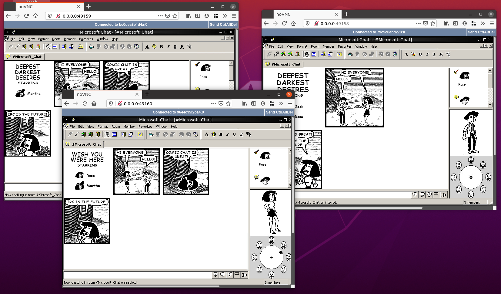
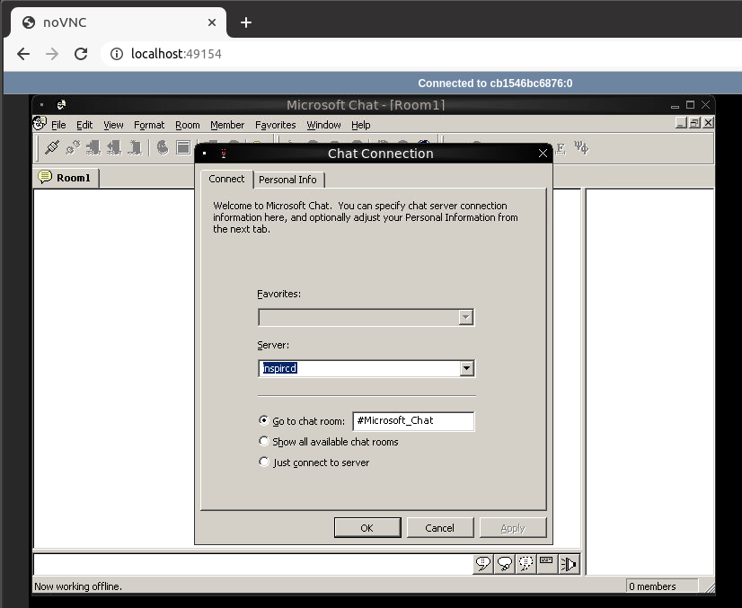

# Comic Chat Docker Compose

Talk to yourself in Microsoft Chat. Spins up an IRC server and an arbitrary number of comic-chat running clients. Access the clients via noVNC and make them talk to each other.



## Why?

Coming up short on practical uses for this one.

## Getting Started

First, start the containers

```
docker-compose up
```

for multiple clients:

```
docker-compose up --scale wine=[NUMBER]
```

Run `docker-compose ps` to find the ports of the containers on localhost.

Remote into one of the client containers by navigating to localhost:PORT in a web browser. Then, right-click on the desktop and select *MS Chat*. Enter *inspircd* as the server to connect to the containerized IRC server. 



Run `docker-compose down` when you're finished.

## Adding Custom Characters and Backgrounds

To add custom characters/backgrounds, copy them to the ComicArt folder. It's mapped as a volume to the client containers' ComicArt folder. 


## Comic Chat Resources

- [Mermeliz comic chat resource page](http://mermeliz.com/index.htm) (.exe was downloaded from here)
- [Tips for running in Wine](http://microsoftchat.blogspot.com/2018/01/successful-installation-of-microsoft.html)

## TODO

- Autostart comic chat instead of explorer

